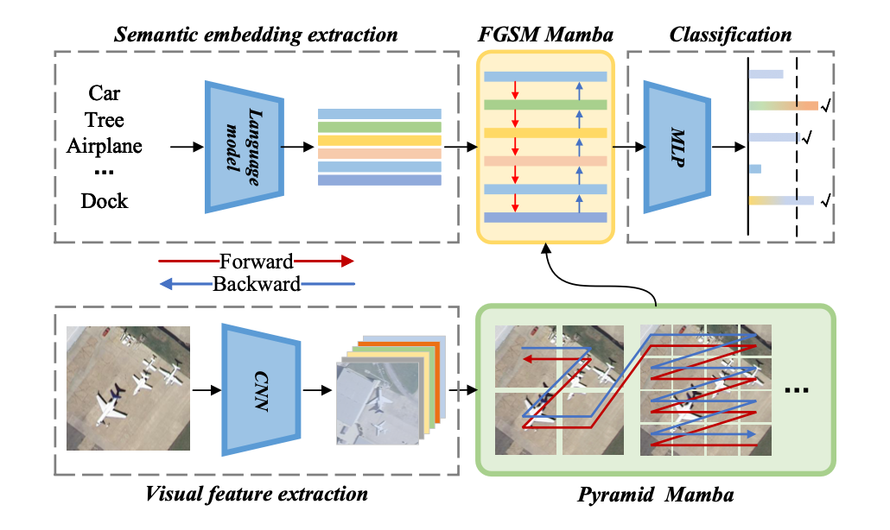

# MLMamba

This repository provides the code for the method in our paper '**MLMamba: A Mamba-based Efficient Network for Multi-label Remote Sensing Scene Classification**'. (TCSVT2025)

We will update the core code after the Spring Festival holiday.

**If you have any questions, you can send me an email. My mail address is 24171111300@stu.xidian.edu.cn.**

## Datasets

We conduct experiments on the UCM-ML, AID-ML, and DFC15-ML datasets. To train and test our model, you should download the required data set and modify the corresponding parameters in *main.py* to meet your needs.

## Requirements

>python 3.7 
>torch 1.12.1 
>scikit-learn 1.0.2 
>numpy 
>einops

## Train and inference

for train and inference, please refer to our another work['**Semantic-assisted Feature Integration Network for
Multi-label Remote Sensing Scene Classification**'. (TGRS2024)](https://github.com/TangXu-Group/multilabelRSSC/edit/main/SFIN/)
